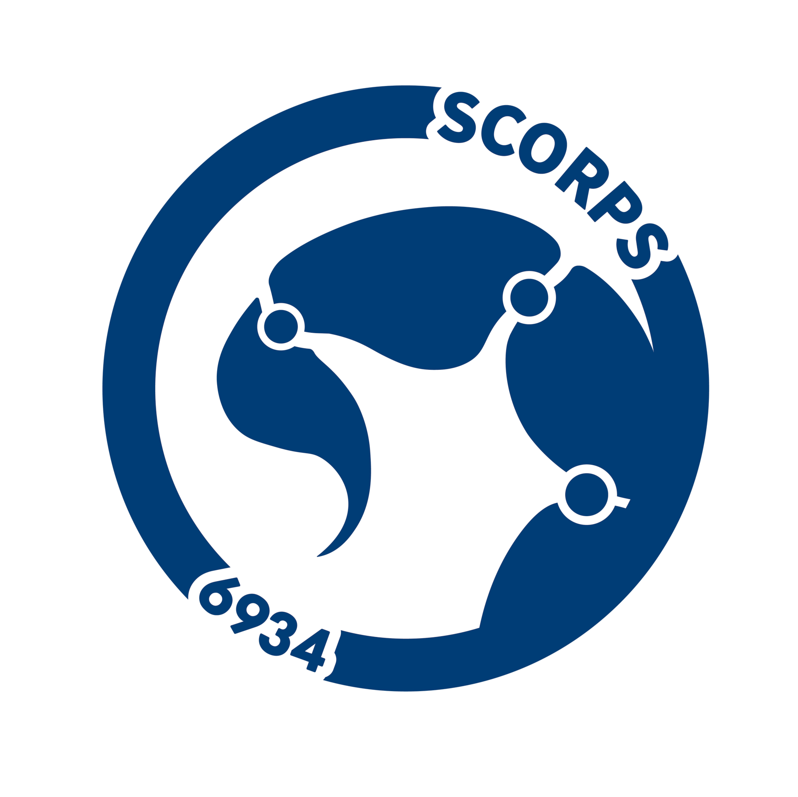

# Description: 
The current[^1] 2025-2026 robotics code for FRC team 6934.

## Changelog: 
- Added documentation for the robot's hardware specs 3/2/26
- Updated the teleoperated swerve code for FRC 2026 3/2/26
- Started rudimentary shooter code 3/2/26
- Code now uses Elastic and AdvantageScope for telemetry, as SmartDashboard is deprecated in 2027 3/2/26
- Vision system is now reworked; details below.3/2/26
- (!) Updated the LimelightHelpers file for FRC 2026 3/2/26
- (!) Upgraded hardware (Limelight 3G -> Limelight 4) 3/2/26
- (!) Swerve.java now fuses odometry + gyro + LL4's MT2 spatial coordinate estimation every periodic 3/2/26
- (!) Swerve.java now automatically pushes robot yaw and yaw rate from the Pigeon 2.0 -> Limelight with the LimelightHelpers method `SetRobotOrientation`, using `getBotPoseEstimate_wpiBlue_MegaTag2` to read as a vision measurement to a Pose2D object 3/2/26
- (!) VisionInfo.java is no longer a giant hardcoded per-tag goalpoint lookup table, and now is a live helper layer that provides TX/TY, nearest tag distance from `rawFiducials`, tag yaw error from target-space pose, and pipeline selection (for easy LL tuning between pipelines, and testing for exposure length/black-white balance) 3/2/26
- (!) New command `VisionAutoAlign` that forces the AprilTag pipeline and sets a LL 3D fiducial offset, where strafe PID drives TX to zero, yaw PID drives tag-rel yaw to zero, and forward PID drives to the nearest-tag distance stored as `autoAlignGoalDistanceMeters`. 3/2/26
- Shooter is now functional; two X60s run the flywheels at a constant 3000 RPM using a PID controller.
- Shooter complex is now functional; two X44s feed fuel using both 2.25 inch compliant wheels and conveyor belts. Holding B will feed any fuel into the shooter flywheels; releasing will reverse the direction for 0.25 seconds to prevent jams.

## Issues and Potential Errors:   
- Vision code is still untested
- Lack of a mechanical intake/climbing system

## To-Do List:  
- [ ] Write documentation for vision methods
- [ ] Write a PID controller for the shooter motors so they recover RPM faster after each shot
- [ ] Find goal positions and other auto-related routes

### Unused Code  
- N/A. 

### Notes  
- All code should be well-documented, tested and reviewed before deployment.

## Credits  
- Source of Original Swerve Code: https://github.com/dirtbikerxz/BaseTalonFXSwerve  
- Modified Code Created By: Evan Wang, Lukas Evans, Will Redekopp, Derek Chang
- Robot Technician: Sawyer Scholle
- Robot Created By: FRC Robotics Team 6934 (ACHS Scorpions)  

## Falcon Swerve Chassis Configs  
> [!WARNING]
> The Falcon swerve chassis is currently out of order. Please do not change the below values until it is deemed functional again.

| Name/Component | Offset (Degrees) |
| :--- | :---: |
| Swerve Module 0 | 105.732422 |
| Swerve Module 1 | 160.400391 + 180 |
| Swerve Module 2 | -171.123047 |
| Swerve Module 3 | 59.853516 + 180 |
| CANivore Name | "Canivor<3" |

## Kraken Swerve Chassis Configs  

| Name/Component | Offset (Degrees) |
| :--- | :---: |
| Swerve Module 0 | 131.8359375 |
| Swerve Module 1 | 133.68164 + 180 |
| Swerve Module 2 | 50.1855 |
| Swerve Module 3 | -73.740234375 + 180 |
| CANivore Name | "Second Canivor<3" |

## Control Bindings  
### Drive Controller (**PORT 0**):   
- Field-Centric Driving: *MOVE* Left Joystick (X & Y)  
- Yaw Control: *MOVE* Right Joystick (x)  
- Reset Gyro (Field-Centric Driving ONLY): *PRESS* Y-Button  
- Toggle Slow Mode: *PRESS* Right Bumper

### Weapons Controller (**PORT 1**):
- N/A.

## General Hardware Information

### Swerve Specifications:
- MODEL: SDS MK4i Swerve w/ L2 gearing
- AZIMUTH/ANGLE MOTORS: Kraken X60
- DRIVE MOTORS: Kraken X60
- ABSOLUTE ENCODERS: CTRE CANcoders
- GYROSCOPE: Pigeon 2.0
### Vision System:
- CAMERA: Limelight 4
### Other:
- ADDITIONAL CAN CAPACITY - CANivore

[^1]: Last updated 3/2/26 by Derek Chang.

